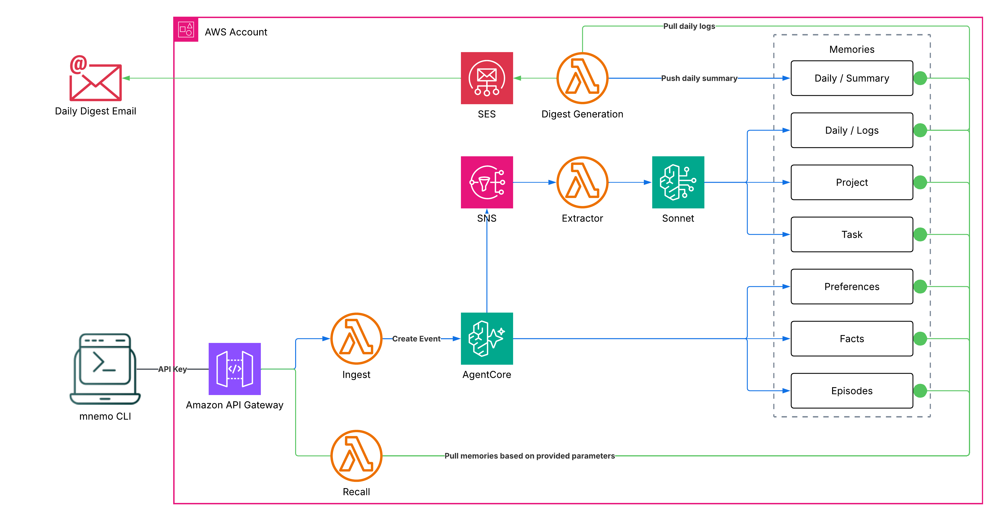

# mnemo

Centralized AI memory system built on Amazon Bedrock AgentCore Memory that lets any AI tool push conversation turns and recall relevant context (preferences, facts, a living "about me" bio, project decisions, daily summaries) through a simple REST API, following you across sessions, workstations, and actors.

Ships with a CLI and Claude Code hooks as the first integration, but the API is client-agnostic.

## How it works

mnemo exposes a REST API backed by Bedrock AgentCore Memory, so clients never touch AWS directly and instead push conversation turns and recall memories through `POST /events` and `GET /recall`.

**Write path:** A client sends conversation turns to `POST /events`. The Ingest Lambda maps them to AgentCore's `CreateEvent` API. AgentCore asynchronously extracts memories using its built-in strategies and triggers the context extractor for self-managed ones.

**Read path:** A client calls `GET /recall` with explicit dimension flags to select which memory types to retrieve. The Recall Lambda queries only the requested namespace prefixes in parallel and merges the results. No dimensions are returned by default.

### Memory dimensions

| Dimension | Type | Namespace | What it captures |
|---|---|---|---|
| Preferences | built-in | `/preferences/{actorId}/` | Coding style, standards, tool preferences |
| Facts | built-in | `/facts/{actorId}/` | General knowledge and facts |
| Episodes | built-in | `/episodes/{actorId}/` | Structured episodes with reflections |
| About | self-managed | `/about/{actorId}/` | Living biographical profile (name, role, background, identity) |
| Project | self-managed | `/projects/{actorId}/{projectName}/` | Architecture decisions, tech choices, project state |
| Task | self-managed | `/tasks/{actorId}/{taskDomain}/` | Domain-specific insights (e.g., coding, studying, meeting) |
| Daily Log | self-managed | `/daily/{actorId}/{YYYY-MM-DD}/log/` | Append-only detailed activity entries throughout the day |
| Daily Summary | self-managed | `/daily/{actorId}/{YYYY-MM-DD}/summary/` | Structured end-of-day digest (projects, learnings, time allocation, reflection) |

Built-in strategies are extracted automatically by AgentCore. The self-managed dimensions (about, project, task, daily) are handled by the context extractor and digest Lambdas:

The **context extractor** runs throughout the day, triggered by AgentCore via SNS. For each event it makes two Claude Sonnet calls in parallel — one that classifies the task domain and produces project/task facts plus a daily log entry, and one dedicated to biographical extraction for the About dimension. Project, task, and about records are consolidated per namespace (a distilled version that supersedes prior records); daily log entries are appended throughout the day.

The **about** dimension is strictly biographical. The extraction prompt is tuned to trust user turns as first-person testimony, to trust assistant turns only when grounded in something the user supplied (e.g., "here's my resume"), and to skip project implementation details (version numbers, file paths, module names, port numbers) which belong in project memory. The consolidation prompt always runs for this dimension — even on the first write — to enforce a flowing narrative-paragraph shape rather than a bullet list.

The **daily digest** Lambda runs on a per-actor schedule. A dispatcher Lambda runs on a single EventBridge schedule, scans the actors table, and emits one SQS message per digest-enabled actor. The digest Lambda consumes that queue, reading each actor's id, email, and timezone from the message, and produces a structured summary with sections for projects worked on, decisions, learnings, time allocation, blockers, and a reflection. The summary is written to the daily summary namespace and optionally emailed via SES.

Task domain classification uses a configurable list of domains (default: `coding`, `studying`, `meeting`, `general`), while project detection relies on the git repo folder name, so sessions outside a git repo only get global memories (preferences, facts, episodes, about) with no project context.

### Architecture



## Prerequisites

- Node.js 22+
- AWS account with CDK bootstrapped (`npx cdk bootstrap`)
- AWS CLI configured with credentials
- Bedrock AgentCore Memory access enabled in your region
- `jq` installed (optional, only useful for direct API debugging since hooks no longer require it)

**Important:** The `@aws-sdk/client-bedrock-agentcore` package must be available in the Lambda runtime for the ingest, recall, and context-extractor functions. This package is pre-installed in the Node.js 22 Lambda runtime. The CDK stack uses the native `AWS::BedrockAgentCore::Memory` CloudFormation resource, so no control-plane SDK is needed at deploy time.

## Deploy

### 1. Install dependencies

```bash
git clone https://github.com/tiagodeoliveira/mnemo.git && cd mnemo
npm install
```

### 2. Run tests

```bash
cd infra && npx vitest run
cd ../cli && npx vitest run
```

### 3. Configure environment variables

Copy the example env file and fill in your values:

```bash
cp infra/.env.example infra/.env
```

Edit `infra/.env`:

```env
# Required: seed actor for the actors table on first deploy
ACTOR_ID=<your-name>
# Optional: email for alarm notifications and the seed actor's daily digest
NOTIFICATION_EMAIL=you@example.com
# Optional: EventBridge cron for the digest dispatcher (default: cron(0 23 * * ? *))
DIGEST_SCHEDULE=cron(0 19 * * ? *)
# Optional: IANA timezone used both for the dispatcher schedule and for the seed actor's digest date (default: UTC)
DIGEST_TIMEZONE=America/Los_Angeles
# Optional: 'dev' or 'production' (default: production)
ENVIRONMENT=production
```

`ACTOR_ID` is required and the deploy will fail without it. On first deploy it seeds a DynamoDB actors table with a row containing this id, the notification email, the timezone, and `digestEnabled=true`. Subsequent deploys do not overwrite that row, so you can edit, disable, or add actors without fighting the stack. The public ingest and recall Lambdas currently use this value as a hardcoded identity shim; multi-actor routing via API key or JWT is coming. The internal pipeline (context extractor, digest) already reads the actor per event/message and is ready for multiple actors. You can also pass `ACTOR_ID` via CDK context flags (`--context actorId=<your-name>`), which take precedence over the `.env` file.

`NOTIFICATION_EMAIL` is used for both CloudWatch alarm notifications (via SNS, requires email confirmation after deploy) and the seed actor's daily digest delivery. The seed actor's row in the actors table stores this email; the digest Lambda reads it from the SQS message at send time. Additional actors get their own email from their own row. The SES sender identity is configured once at the stack level and must be verified in SES sandbox mode.

Use `DIGEST_SCHEDULE` to control when the dispatcher fires. It runs once per trigger and fans out one SQS message per digest-enabled actor. Examples: `cron(0 19 * * ? *)` for 7pm daily, `cron(0 19 ? * MON-FRI *)` for weekdays only.

`ENVIRONMENT` controls the payload bucket's removal policy. The default `production` retains the bucket on `cdk destroy` so up to 7 days of unprocessed event payloads (the raw material for context extraction and daily digests) survive accidental teardown. Set it to `dev` for iteration — the bucket is destroyed with the stack and an auto-delete helper empties it first.

### 4. Deploy the CDK stack

```bash
cd infra
npx cdk deploy
```

Note the outputs:
- **ApiUrl**: your REST API endpoint (e.g., `https://abc123.execute-api.us-east-1.amazonaws.com/v1`)
- **ApiKeyId**: the API key ID (not the value)

### 5. Get the API key value

List the stack outputs (API URL and API key ID):

```bash
aws cloudformation describe-stacks --stack-name MnemoStack --query 'Stacks[0].Outputs' --output table
```

Then retrieve the actual API key value using the API key ID from the output:

```bash
aws apigateway get-api-key --api-key <API_KEY_ID> --include-value --query 'value' --output text
```

## Configure

### 6. Build the CLI and install

```bash
cd cli && npm run build
npm link -w mnemo-cli
```

Run `npm link` from the monorepo root, or alternatively `cd cli && npm link`.

This makes the `mnemo` command available globally.

### 7. Edit the mnemo config

Open `~/.mnemo/config.json` and fill in the values from the deploy outputs:

```json
{
  "apiUrl": "https://<api-id>.execute-api.<region>.amazonaws.com/v1",
  "apiKey": "<your-api-key-value>",
  "workstation": "personal-laptop",
  "defaults": {
    "visible": true
  }
}
```

- `workstation`: friendly name for this machine, defaults to hostname if omitted.
- `visible`: when `true` recalled memories are shown as markdown, and when `false` they're returned as a JSON structure suitable for programmatic injection.

## Usage

### CLI

**Push** conversation turns:

```bash
mnemo push \
  --session "test-$(date +%s)" \
  --turns '[{"role":"user","content":"I prefer TypeScript with strict mode"},{"role":"assistant","content":"Noted, I will use strict TypeScript."}]' \
  --project mnemo \
  --source my-tool \
  --workdir "$(pwd)" \
  --attr owner=tiago --attr priority=high
```

Arbitrary `--attr key=value` flags are optional and repeatable. They pass through to AgentCore event metadata (under `attr.<key>`) and are embedded in the extractor-visible context turn. These attributes are not queryable on recall today — see the note under [Searching with `q=`](#searching-with-q) — but they stay on the event for future use.

**Recall** memories by selecting one or more dimensions:

```bash
# Just today's daily summary
mnemo recall --daily

# Preferences and facts
mnemo recall --preferences --facts

# Biographical profile
mnemo recall --about

# Project memories for a specific project
mnemo recall --project mnemo

# Combine dimensions freely
mnemo recall --facts --about --project mnemo --task coding --date 2026-04-15

# Override the default per-dimension search query
mnemo recall --preferences --facts --q "Rust async runtimes"

# Everything at once
mnemo recall --all
```

Running `mnemo recall` with no flags shows help. Each flag is opt-in and only queries the corresponding namespace in the backend:

| Flag | What it queries |
|---|---|
| `--preferences` | User preferences and style |
| `--facts` | General knowledge and facts |
| `--episodes` | Structured episodes with reflections |
| `--about` | Living biographical profile (name, role, background, identity) |
| `--project <name>` | Project-specific memories (auto-detected from git if no name given) |
| `--task <name>` | Task domain memories (e.g., coding, studying, meeting) |
| `--date <yyyy-mm-dd>` | Daily summary or log for a specific date |
| `--daily` | Daily summary or log for today |
| `--all` | All dimensions (auto-detects project, defaults task to coding, date to today) |
| `--q <query>` | Override the default search query across every requested dimension |

Output format is controlled by `--format`:
- `visible`: human-readable markdown (default when `defaults.visible` is `true` in config)
- `hook`: JSON structure for programmatic injection

**Hook** commands process AI client hook events directly from stdin:

```bash
# Process a UserPromptSubmit event (reads JSON from stdin)
echo '{"session_id":"s1","transcript_path":"/path/to/transcript.jsonl","cwd":"/project"}' \
  | mnemo hook prompt-submit

# Process a SessionStart event (reads JSON from stdin, outputs hook JSON)
echo '{"cwd":"/project"}' | mnemo hook session-start
```

The `hook` commands handle all the heavy lifting that used to live in shell scripts, including transcript parsing, control character sanitization, turn extraction, activity summarization, batch counting, and API calls, all implemented in tested TypeScript.

## Integrations

mnemo is client-agnostic. Any tool that can make HTTP calls or shell out to the CLI can push turns and recall memories. The built-in integrations all follow the same pattern:

1. **Install:** `mnemo install <client>` creates `~/.mnemo/config.json` (if needed), copies hook scripts, and registers them with the client.
2. **Session start:** The client fires a session-start hook. mnemo detects the project from git, recalls preferences, facts, about, project, task, and daily memories, and injects them as hidden context.
3. **Prompt submit:** After each prompt, the client fires a prompt-submit hook. mnemo reads the transcript, extracts turns and tool activity, deduplicates against a per-session cursor (`~/.mnemo/cursors/{sessionId}.json`), and pushes only the new turns to the API. Cursors older than 2 days are pruned automatically.
4. **Memory extraction:** AgentCore extracts preferences, facts, and episodes asynchronously. The context extractor runs a second parallel LLM pass to update the `about` biographical profile and writes project, task, and daily log entries.

All hook shim scripts include a `command -v mnemo` guard so they silently no-op if the CLI is not installed on a machine. Use `--force` on any install command to re-copy hook scripts and rewrite stale entries in the client's settings file.

### Direct API

Any client can use the REST API directly without the CLI:

```bash
# Push turns (with optional arbitrary attributes)
curl -s -X POST -H "x-api-key: <key>" -H "Content-Type: application/json" \
  "https://<api-url>/v1/events" \
  -d '{
    "sessionId": "s1",
    "turns": [{"role": "user", "content": "hello"}],
    "context": {
      "workstation": "laptop",
      "workdir": "/home/user/project",
      "timestamp": "2026-05-07T15:00:00Z",
      "attributes": {"owner": "tiago", "priority": "high"}
    }
  }'

# Recall specific dimensions (all are opt-in)
curl -s -H "x-api-key: <key>" \
  "https://<api-url>/v1/recall?preferences=true&facts=true&about=true&project=mnemo" | jq
```

| Parameter | Example | Effect |
|---|---|---|
| `preferences=true` | `?preferences=true` | Include user preferences |
| `facts=true` | `?facts=true` | Include general facts |
| `episodes=true` | `?episodes=true` | Include episodic memories |
| `about=true` | `?about=true` | Include the living biographical profile |
| `project=<name>` | `?project=mnemo` | Include project-specific memories |
| `task=<domain>` | `?task=coding` | Include task domain memories |
| `date=<yyyy-mm-dd>` | `?date=2026-04-15` | Include daily summary (or log fallback) |
| `q=<query>` | `?q=Rust%20async%20runtimes` | Override the default per-dimension search query with a custom one (trimmed; max 1024 chars) |

`context.attributes` on ingest is an optional map of up to 32 string key/value pairs (keys `^[a-zA-Z0-9_.-]+$`, max 64 chars; values max 512 chars). They travel with the event as AgentCore metadata and are exposed to the context extractor. No dimensions on recall returns an empty object (`{}`).

#### Searching with `q=`

Each dimension has a sensible default search query baked into the recall Lambda (e.g., preferences uses "preferences, standards, style, and workflow habits"). Pass `?q=<text>` to override that query across every requested dimension in a single call:

```bash
# Find anything related to "Rust async runtimes" across preferences and facts
curl -sG -H "x-api-key: <key>" \
  --data-urlencode 'preferences=true' \
  --data-urlencode 'facts=true' \
  --data-urlencode 'q=Rust async runtimes' \
  "https://<api-url>/v1/recall"
```

`q=` is semantic-search text forwarded to AgentCore's `searchCriteria.searchQuery`. It ranks records by similarity to the provided text — it does not restrict results the way a metadata filter would. Metadata-based filtering (e.g., "only records where `source=codex`") is not offered today: AgentCore's `BatchCreateMemoryRecords` does not accept record metadata, and record-level metadata filtering on retrieve has a closed allowlist that currently rejects arbitrary application keys. mnemo's own scoping (actor, project, task, date) is expressed via namespaces instead, so combine `q=` with the dimension flags to narrow before you search.

### Claude Code

```bash
mnemo install claude-code
```

Copies shim scripts to `~/.mnemo/hooks/claude-code/` and registers them in `~/.claude/settings.json` (SessionStart for recall, UserPromptSubmit for push). Override the destination with `--mnemo-hooks-dir /custom/path`.

The shim scripts are thin wrappers (4-5 lines) that delegate to `mnemo hook` commands, with all transcript parsing, control character handling, turn extraction, and activity summarization implemented in TypeScript and covered by tests.

### Codex

```bash
mnemo install codex
```

Copies shim scripts to `~/.mnemo/hooks/codex/` and registers them in `~/.codex/hooks.json`. Override the destination with `--mnemo-hooks-dir /custom/path`.

The transcript parser auto-detects the format (Claude Code vs Codex) so the same `mnemo hook` commands handle both clients transparently. Codex runs commands in a network-restricted sandbox by default, but hooks fire as external processes outside the sandbox, so network calls to the mnemo API work without any special configuration.

### Gemini CLI

```bash
mnemo install gemini-cli
```

Copies Gemini-specific shim scripts to `~/.mnemo/hooks/gemini-cli/` and registers them in `~/.gemini/settings.json` (SessionStart for recall, AfterAgent for push). Override the destination with `--mnemo-hooks-dir /custom/path`.

Gemini CLI hooks require JSON-only stdout, so the Gemini shims always return `{}` when there is no context to inject. The push hook uses Gemini's AfterAgent payload (`prompt` and `prompt_response`) instead of depending on Gemini's private transcript JSON shape.

### OpenClaw

```bash
mnemo install openclaw
```

Copies a packaged hook into `~/.openclaw/hooks/mnemo/` and runs `openclaw gateway restart`. Unlike the coding-tool integrations, OpenClaw captures `message:received` and `message:sent` events, pairs them into user/assistant exchanges, and pushes them through `mnemo push`.

Options:

```bash
mnemo install openclaw --dry-run          # preview without changes
mnemo install openclaw --no-restart       # skip gateway restart
mnemo install openclaw --force            # overwrite drifted hook files
mnemo install openclaw --channels telegram,whatsapp
mnemo install openclaw --openclaw-hooks-dir /custom/openclaw/hooks
```

- Use `--channels` to write a channel allowlist to `~/.openclaw/hooks/mnemo/.env`. If omitted, all channels are accepted.
- Set `MNEMO_OPENCLAW_WORKDIR` in the OpenClaw gateway environment to use a specific workdir for project detection.
- Logs are written to `~/.openclaw/logs/` as append-only JSONL (not rotated automatically).

### Hook logging

All hook commands write diagnostic logs to `~/.mnemo/mnemo.log` (configurable via `MNEMO_LOG_PATH`). The log auto-rotates at 5MB, keeping one backup (`.1`). Useful for debugging hook behavior:

```bash
tail -f ~/.mnemo/mnemo.log
```

### Adding a new integration

Any AI tool with a hook or plugin system can integrate with mnemo:

1. On session start, pipe `{"cwd":"/path"}` to `mnemo hook session-start` and inject the returned JSON into the conversation.
2. After each prompt, pipe `{"session_id":"...","transcript_path":"...","cwd":"..."}` to `mnemo hook prompt-submit` to push turns. Clients with explicit post-turn fields can also pipe a Gemini-style `AfterAgent` payload with `prompt`, `prompt_response`, and `timestamp`.

The transcript parser currently supports Claude Code and Codex JSONL formats. Adding support for a new format requires implementing a turn extractor in `cli/src/transcript.ts`.

## Multi-actor support

A single mnemo deployment can serve multiple actors. Every piece of memory — preferences, facts, episodes, about, projects, tasks, daily logs and summaries — is namespaced by `actorId`, so two actors never see each other's records.

### The actors table

The stack provisions a DynamoDB table keyed by `actorId` that drives per-actor behavior:

| Attribute | Purpose |
|---|---|
| `actorId` | Partition key. Matches the id stamped on AgentCore events. |
| `email` | Destination for this actor's daily digest email. Optional; missing email skips SES, still writes the summary to memory. |
| `timezone` | IANA zone used to compute the actor's local date for digest namespaces. Defaults to UTC if missing. |
| `digestEnabled` | Boolean. `false` pauses the digest for this actor without deleting the row. |
| `createdAt` | ISO timestamp set at seed time. Informational. |

On first deploy, a custom resource seeds one row using `ACTOR_ID`, `NOTIFICATION_EMAIL`, and `DIGEST_TIMEZONE` from your `.env`. The seed is conditional (`attribute_not_exists(actorId)`), so redeploys won't overwrite edits or disable-flags you've set manually. The table is retained on `cdk destroy` so actor configuration survives stack teardown.

### Adding another actor

No code change or deploy needed:

```bash
aws dynamodb put-item \
  --table-name MnemoStack-ActorsTable... \
  --item '{
    "actorId":       {"S": "alice"},
    "email":         {"S": "alice@example.com"},
    "timezone":      {"S": "America/New_York"},
    "digestEnabled": {"BOOL": true},
    "createdAt":     {"S": "2026-05-07T00:00:00Z"}
  }'
```

The next dispatcher run will pick up the new row and fan out a digest SQS message for `alice` alongside the existing actors. Each actor's digest uses their own timezone for the local-date calculation and their own email for delivery.

### Where actorId comes from today

The **internal pipeline** (context extractor, daily digest) reads `actorId` from the event it's processing:

- Context extractor reads the top-level `actorId` that AgentCore stamps onto each event payload in S3.
- Digest reads `actorId` from the SQS message it receives from the dispatcher.

Both are ready for multi-actor traffic today.

The **public API** (ingest and recall) still uses `process.env.ACTOR_ID` as a hardcoded identity shim for every request. Until API-key or JWT-based actor resolution is wired through, any client pushing to `/events` or calling `/recall` will land in the seed actor's namespaces. Multi-actor extraction and digest work end-to-end; multi-actor authenticated writes are the last mile.

## Daily digest

mnemo generates a structured end-of-day digest from all the activity logged throughout the day. A dispatcher Lambda runs on the configured schedule, scans the actors table for digest-enabled rows, and enqueues one SQS message per actor. The digest Lambda consumes that queue, reads the actor's id, email, and timezone from each message, synthesizes the day's log entries into a structured reflection using Claude Sonnet, writes the summary to memory, and optionally emails it.

The digest includes: projects worked on, key decisions, learnings, time allocation, blockers and resolutions, and a brief reflection.

### Configuration

Stack-level settings live in `infra/.env` and control when the dispatcher fires and who the emails come from:

```env
NOTIFICATION_EMAIL=you@example.com
DIGEST_SCHEDULE=cron(0 19 * * ? *)
DIGEST_TIMEZONE=America/Los_Angeles
```

`NOTIFICATION_EMAIL` is the verified SES sender identity used as the From address for every actor's digest. It is also used to seed the first actor's email (the To address). `DIGEST_SCHEDULE` controls when the dispatcher fires (e.g., `cron(0 19 ? * MON-FRI *)` for weekdays only). `DIGEST_TIMEZONE` is the zone the EventBridge schedule evaluates against, and it's also used as the seed actor's timezone. Additional actors bring their own email and timezone via the actors table.

The digest Lambda always writes the summary to memory regardless of email configuration. If an actor's row has no `email` or if SES rejects the send, the error is logged and the summary still lives in the actor's `/daily/{actorId}/{date}/summary/` namespace.

**SES verification:** SES starts in sandbox mode, which requires verifying both sender and recipient email addresses before it can deliver mail. Verify your sender identity (the `NOTIFICATION_EMAIL` address) once:

```bash
aws ses verify-email-identity --email-address you@example.com --region <your-region>
```

In sandbox mode you must also verify any recipient address — so every new actor's email you put in the actors table needs its own verification until you request SES production access.

### How it works

1. Throughout the day, the context extractor appends detailed log entries to `/daily/{actorId}/{date}/log/` for each actor whose events pass through.
2. At the scheduled time, EventBridge invokes the **dispatcher Lambda**.
3. The dispatcher scans the actors table for rows with `digestEnabled = true` and enqueues one SQS message per actor, carrying `{actorId, email, timezone}`.
4. The **digest Lambda** consumes the queue. For each message, it computes the actor's local date from their timezone, reads that day's log entries, generates a structured summary with Claude Sonnet, writes the summary to `/daily/{actorId}/{date}/summary/`, and sends it to the actor's email via SES if present.
5. Failed digest runs redrive through SQS up to 3 times before landing in a DLQ.

You can trigger a digest on demand — including for past dates, backfills, or a specific actor — by sending an SQS message directly to the digest queue:

```bash
aws sqs send-message \
  --queue-url <MnemoStack-DispatcherDigestQueue-url> \
  --message-body '{"actorId":"tiago","email":"tiago@example.com","timezone":"America/Los_Angeles","date":"2026-05-01"}'
```

The `date` field is optional; when absent, the digest uses the current local date in the provided timezone. When you recall with `--date`, mnemo returns the summary if available, falling back to raw log entries mid-day before the digest has run.

## Security and infrastructure hardening

The stack applies defense-in-depth across all resources:

- **Encryption at rest:** S3 bucket uses S3-managed encryption, SNS topic uses the `aws/sns` KMS managed key, all CloudWatch Log Groups are encrypted with a shared KMS key (with automatic key rotation)
- **Encryption in transit:** S3 bucket enforces SSL, all SQS queues enforce SSL
- **Public access:** S3 bucket blocks all public access (`BlockPublicAccess.BLOCK_ALL`)
- **Dead-letter queues:** Context extractor SNS subscription has an SQS DLQ (14-day retention); the digest SQS queue has its own DLQ (3 retries before landing); the dispatcher's EventBridge Scheduler has a third DLQ with retry policy (2 retries, 1hr max age)
- **Concurrency limits:** All Lambdas have reserved concurrent executions (ingest: 10, recall: 10, context extractor: 5, digest: 2, dispatcher: 1)
- **X-Ray tracing:** Active tracing enabled on all Lambda functions
- **API Gateway access logging:** JSON-formatted access logs with 1-month retention
- **Input validation:** Ingest Lambda validates Content-Type, JSON structure, max turns (200), max content length per turn (100KB), field lengths, role values, timestamp format, and the optional `attributes` map (max 32 entries; keys `^[a-zA-Z0-9_.-]+$` up to 64 chars; values up to 512 chars)
- **Prompt injection protection:** Context extractor strips newlines and caps metadata at 128 characters before including it in LLM prompts
- **Bounded processing:** Context extractor limits array processing to 200 entries and 500KB total conversation text; output records written to AgentCore are truncated to the 16K hard limit, with consolidation write-then-delete ordering so a truncated write never deletes its predecessor
- **Cold-start validation:** Ingest and recall validate `MEMORY_ID` and `ACTOR_ID`; extractor and digest validate `MEMORY_ID` only (actorId flows through each event/message); dispatcher validates `ACTORS_TABLE` and `DIGEST_QUEUE_URL`
- **Config file permissions:** `mnemo install` creates `~/.mnemo/config.json` with `0o600` (owner-only) permissions; `loadConfig` warns if the file is group/other-readable
- **Resource naming:** All resource names are prefixed with the stack name to avoid conflicts in multi-deploy scenarios

## Observability

The stack deploys a CloudWatch dashboard and alarm set that covers the four core Lambda functions, the API Gateway, and the dead-letter queues.

**Dashboard** (`mnemo`): alarm status overview, ingestion counters, digest counter, API Gateway request counts and latency (p50/p99), and per-Lambda widgets for invocations/errors, duration (p50/p99/max), and concurrent executions.

**Alarms** (20 total, all wired to the `mnemo-alarms` SNS topic):

| Alarm | Condition |
|---|---|
| Ingest/Recall/ContextExtractor/Digest errors | >= 3 Lambda errors in 2 consecutive 5-min periods |
| Ingest/Recall/ContextExtractor/Digest app errors | >= 1 ERROR log entry in a single 5-min period |
| Ingest/Recall duration P99 | >= 10s in 2 consecutive 5-min periods |
| ContextExtractor/Digest duration P99 | >= 180s in 2 consecutive 5-min periods |
| Ingest/Recall/ContextExtractor/Digest throttles | >= 1 throttle in a single 5-min period |
| API Gateway 5xx | >= 5 server errors in 2 consecutive 5-min periods |
| DLQ-0/1/2 not-empty | >= 1 message visible on each DLQ (context extractor, digest, dispatcher scheduler) |

Set `NOTIFICATION_EMAIL` in `infra/.env` to receive alarm notifications via email (requires confirming the SNS subscription after deploy).

All alarm thresholds are configurable via the `ObservabilityConstruct` props (`alarmThresholds`), with the values above as defaults. Resource names (dashboard, alarms, SNS topic) are prefixed with the stack name, so multiple stacks can coexist in the same account.

## Cost

The entire stack runs on serverless infrastructure, so cost scales with usage. Here is a real-world baseline from 3 days of personal use (Apr 13-15, 2026) across Claude Code, Codex, and OpenClaw:

**Usage over 3 days:**

| Metric | Total | Daily avg |
|---|---|---|
| Events ingested | 268 | ~89 |
| Conversation turns ingested | 5,274 | ~1,758 |
| Memory retrievals (recall) | 270 | ~90 |
| Context extractor invocations | 803 | ~268 |
| Daily digests generated | 6 | ~2 |

**Cost over 3 days:**

| Service | 3-day cost | Daily avg | What it covers |
|---|---|---|---|
| Bedrock AgentCore | $1.63 | ~$0.54 | Memory storage, retrieval, event processing, runtime |
| S3 | $0.08 | ~$0.03 | Event payload storage |
| Lambda | $0.04 | ~$0.01 | Ingest, recall, context extractor, digest functions |
| API Gateway | < $0.01 | < $0.01 | REST API requests |
| SNS / SQS | < $0.01 | < $0.01 | Event notifications, dead-letter queues |
| **Total** | **~$1.75** | **~$0.58** | |

AgentCore is the dominant cost, driven primarily by memory retrievals ($0.50/1000 retrievals) and runtime compute for the built-in extraction strategies. Everything else is effectively free-tier for personal use. Bedrock InvokeModel costs (Claude Sonnet for context extraction and digest generation) are minimal and included in the Lambda line.
